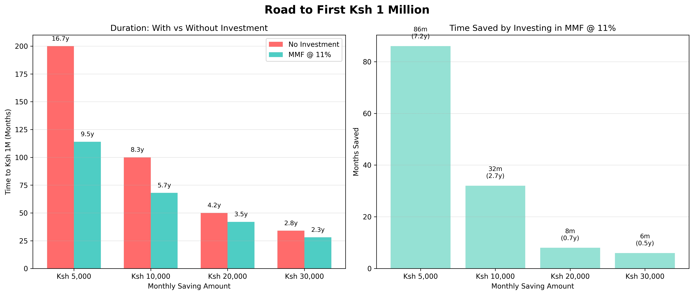
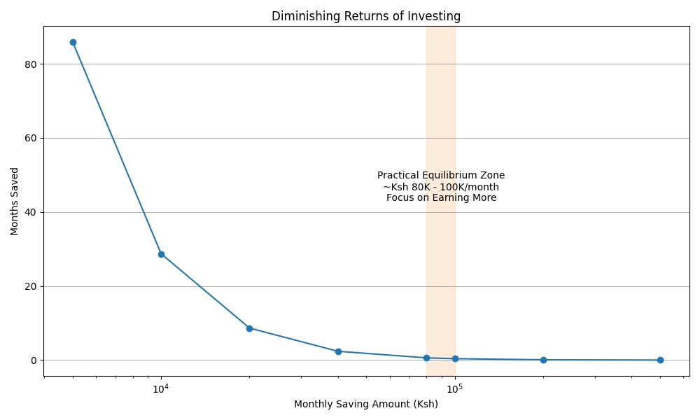

# When Does Investing Stop Mattering?
Analyzing MMF 11% vs Simple Saving in Kenya

## Problem
At what monthly income does the benefit of MMF returns become negligible?

## Method  
Modeled time to reach Ksh 1M using compound interest vs linear saving in Python.

## Key Findings
- Below Ksh 40K/month: Investing saves 2+ years. Critical.
- At Ksh 100K/month: Only saves 1.6 months. Diminishing returns.
- Practical Equilibrium: ~Ksh 80K-100K/month

## Conclusion
Below equilibrium: Focus on investing. 
Above equilibrium: Focus on increasing income and buying assets.

## Tools
Python, NumPy, Pandas, Matplotlib
## Charts

 

